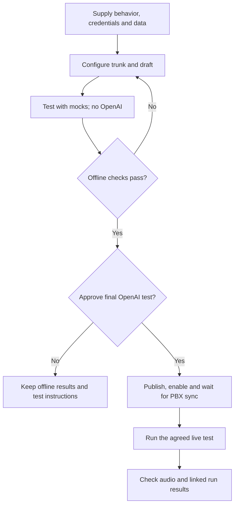

# Satellite

Satellite is a Python application that creates a bridge between Asterisk PBX and Deepgram speech recognition services. It connects to Asterisk ARI (Asterisk REST Interface) and waits for channels to enter stasis. When a channel enters stasis with the application name "satellite", it creates a snoop channel and sends external media to its RTP server address. The RTP server distinguishes various channels from the UDP source port, captures the audio, and forwards it to Deepgram for real-time speech-to-text transcription. Transcription results are then published to an MQTT broker for further processing. If OpenAI API key is provided, it will be used to generate a summary of the transcriptions.

https://github.com/nethesis/satellite

## Voicemail transcription

Voicemail transcription is enabled by setting the environment variable `SATELLITE_VOICEMAIL_TRANSCRIPTION_ENABLED` to `True` (also on NS8 interface)
`DEEPGRAM_API_KEY` should be set to a valid Deepgram API key

The extension should have:
- voicemail enabled
- voicemail email configured
- voicemail email attachment enabled

The voicemail transcription is added to the voicemail message body and saved by Satellite in its transcription database

## Call transcription

Call transcription is enabled by setting the environment variable `SATELLITE_CALL_TRANSCRIPTION_ENABLED` to `True` (also on NS8 interface)
`DEEPGRAM_API_KEY` should be set to a valid Deepgram API key
`OPENAI_API_KEY` should be set to a valid OpenAI API key (For the call summary, optional)

Calls are transcribed in real time and the transcription is published to an MQTT broker for further processing.

On topic `satellite/transcription` real time transcription is published.
Example:

```
satellite/transcription {"uniqueid": "1750153516.571", "transcription": "Prova", "timestamp": 17.1, "speaker_name": "Foo 1", "speaker_number": "201", "is_final": false}
satellite/transcription {"uniqueid": "1750153516.571", "transcription": "Prova", "timestamp": 17.1, "speaker_name": "Foo 1", "speaker_number": "201", "is_final": true}
```

On topic `satellite/final` final transcription and summary are published.
Example:
```
satellite/final {"uniqueid": "1750153516.571", "raw_transcription": "\nFoo 1: Prova\nprova prova\nfunzioni allora\n"}
satellite/final {"uniqueid": "1750153516.571", "clean_transcription": "Foo 1: Prova  \nProva prova  \nFunzioni allora  "}
satellite/final {"uniqueid": "1750153516.571", "summary": "- Foo 1: \"Prova\"\n- \"prova prova\"\n- \"funzioni allora\""}
```

## Environment variables

`ASTERISK_URL`: http://127.0.0.1:${ASTERISK_WS_PORT}

`ARI_APP`: ${SATELLITE_ARI_APP}

`ARI_USERNAME`: ${SATELLITE_ARI_USERNAME}

`RTP_PORT`: ${SATELLITE_RTP_PORT}

`MQTT_URL`: mqtt://127.0.0.1:${SATELLITE_MQTT_PORT}

`MQTT_TOPIC_PREFIX`: satellite

`LOG_LEVEL`: ${SATELLITE_LOG_LEVEL}

`MQTT_USERNAME`: ${SATELLITE_MQTT_USERNAME}

`DEEPGRAM_API_KEY`: ${SATELLITE_DEEPGRAM_API_KEY}

`OPENAI_API_KEY`: ${SATELLITE_OPENAI_API_KEY}

`HTTP_PORT`: ${SATELLITE_HTTP_PORT}

`PGVECTOR_HOST`: 127.0.0.1

`PGVECTOR_PORT`: ${SATELLITE_PGSQL_PORT}

`PGVECTOR_DATABASE`: ${SATELLITE_PGSQL_DB}

`PGVECTOR_USER`: ${SATELLITE_PGSQL_USER}

`PGVECTOR_PASSWORD`: ${SATELLITE_PGSQL_PASSWORD}


## NethServer 8 variables

`SATELLITE_RTP_PORT`: 

`SATELLITE_ARI_USERNAME`: satellite

`SATELLITE_HTTP_PORT`:

`SATELLITE_MQTT_PORT`:

`SATELLITE_VOICEMAIL_TRANSCRIPTION_ENABLED`:

`SATELLITE_MQTT_USERNAME`: satellite

`SATELLITE_LOG_LEVEL`: verbosity of the satellite container, `WARNING` by default.
`INFO` restores the per-stream, per-channel and per-request lines; `DEBUG` adds more.
The value also sets uvicorn's level, so it governs the HTTP access log too.

`SATELLITE_ARI_APP`: satellite

`NETHVOICE_SATELLITE_IMAGE`:

`SATELLITE_CALL_TRANSCRIPTION_ENABLED`:

`SATELLITE_PGSQL_PORT`: 

`SATELLITE_PGSQL_DB`: satellite

`SATELLITE_PGSQL_USER`: satellite


## Testing real time call transcription

```
export $(grep SATELLITE_MQTT_PASSWORD passwords.env); podman exec -it satellite-mqtt mosquitto_sub -h 127.0.0.1 -p "${SATELLITE_MQTT_PORT:-1883}" -u "$SATELLITE_MQTT_USERNAME" -P "$SATELLITE_MQTT_PASSWORD" -t "#" -v
```

## Testing /api/get_transcription endpoint

```
export $(grep SATELLITE_API_TOKEN passwords.env);curl "http://127.0.0.1:${SATELLITE_HTTP_PORT}/api/get_transcription" --show-error --request POST --form "multichannel=false" --form "encoding=linear16" --form "sample_rate=8000" --form "channels=1" --form "persist=false" --form "summary=false" --header "Authorization: Bearer ${SATELLITE_API_TOKEN}" --form "file=@test.wav;type=audio/wav"
```

## NethVoice Agents monitoring (Phase 3)

The [monitoring contract](monitoring-api-contract.md) defines the private runtime
API, administrator gateway, policy, storage and retention. The
[implementation report](phase3-development.md) records delivered source and
pending validation. Open the dedicated area at `/freepbx/wizard/#!/agents`.
Transcript capture defaults to off; metadata retention defaults to 30 days,
enabled transcripts to 7 days. History storage is independent of legacy audio
transcription and does not gate call handling.

Runtime code is maintained in [Nethesis/satellite, branch agent](https://github.com/Nethesis/satellite/tree/agent).
This branch builds the runtime from `runtime-ref` and `phase5-runtime.patch`.
`phase5-runtime.sha256` identifies the patch. The wrapper uses a pinned base image.
The build checks imports, API routes and source versions. See the
[Phase 5 implementation](phase5-development.md) for build and release details.

See [transfer and browser verification](transfer-test-report.md) for automatic
capabilities, named destinations, offline provider tests and live UI checks.

## Application integrations and machine API (Phase 4)

The [application API contract](phase4-api-contract.md) documents setup, HTTPS
connector policy, scoped machine runs, effect reconciliation, retention and
lifecycle. Open the administrator pages at `/freepbx/wizard/#!/agents/connectors`
and `/freepbx/wizard/#!/agents/api`. Access starts disabled. The independent
`SATELLITE_APPLICATION_CONTENT_KEY` protects application credentials and content;
it is generated/preserved by NS8 lifecycle actions and backed up in `passwords.env`.

The [implementation report](phase4-development.md) and
[local verification](phase4-test-report.md) record delivered source and pending
live acceptance. OpenAI is the selected text provider; the actual business API
details remain owner input. No Phase 4 production deployment is implied.

## Visual agent builder (Phase 5)

Use the Builder to connect blocks and define an agent's behavior. Custom agents
appear beside the built-in agents. Each agent shows its available tools.
Templates include a call router, a customer-support agent and a payment secretary.
The payment source can be text, CSV, XLSX, private Google Sheets or published Google CSV.

The [agent workflow skill](https://github.com/nethesis/ns8-nethvoice/tree/agent/freepbx/var/www/html/freepbx/admin/modules/satellite/skills/nethvoice-agent-workflows/SKILL.md)
helps a coding agent create, configure and test these workflows. Ask it to read
that skill and describe the workflow you need. It asks for missing credentials
and data. It tests with mock data first. It asks for confirmation before the
final OpenAI test. The skill is stored in this branch; publication is separate.

### Create the trunk and data sources

1. Give the assistant your PBX address, workflow name and required behavior.
   State whether the workflow handles calls or API requests.
2. For calls, select an existing compatible agent trunk or create one in
   **Agent Trunks**. Select **Builtin Satellite** as its runtime. For OpenAI,
   supply the project ID and project API key. Use the password field for the key.
3. Open **Webhooks**. Use the exact URL shown there for the provider webhook.
   Store its signing secret on that page. A saved setting does not prove that
   the remote provider connection works.
4. Open **Connections** for integration credentials and connector operations.
   Enter secrets through the credential form. Do not put keys in a graph or report.
5. Open **Data sources** for payment data. Map the fields, preview the rows and
   publish the data. Use a viewer service account for a private Google Sheet.
   A published Google CSV needs its published download URL and no Google key.
   See [Google Sheets setup](google-sheets-setup.md).

An API-only workflow does not need a SIP trunk. It needs an explicit text model
and a stored credential reference. Its client also needs access to the workflow.

### Define the behavior

Open **Builder**. Copy a template or create a blank graph. Select the provider
binding for a voice workflow. Set its prompts, language, inputs, tools and fallback.
Select published versions of connectors, data sources and reusable blocks.

Tell the assistant which outcomes you need. Include the failure paths:

| Workflow | Decisions to supply |
|---|---|
| Call router | Allowed PBX destinations and agents, disabled objects, fallback and delegated tools |
| Customer support | Caller lookup, ticket fields, support extensions, assignee mapping, documentation source and confirmation rules |
| Payment secretary | Resident fields, caller matching, unknown-caller verification, month, currency and source age limit |

Router targets start disabled. Enable only the required targets. Tool selection
does not grant access. Enable the required operation grants separately.

A payment name alone does not permit disclosure. Use the agreed caller-number
or code verification rule. If similar-name matching is selected, codes still
match exactly. An ambiguous resident match must fail verification.

Support ticket creation and urgency changes require caller confirmation.
Consultation holds the caller while the operator hears the private summary.
The operator must accept before the transfer. Decline or no answer returns to
the caller. Configure the fallback branch for each of these outcomes.

Save and validate the draft. Correct each reported error before publication.
Check that the saved settings match your choices. Published versions do not
change. Publish a new graph version to use a newer data or connector version.

### Test without OpenAI first

The assistant first tests with synthetic inputs and mock responses. This test
makes no provider calls, no real transfers and no external business changes.
It does not generate test speech through OpenAI.

In the editor, open **Test**, enter the caller and conversation fixtures, and
select **Run mock**. Check the node outcomes in the table below the test form.
The result must take the expected success or fallback branch.

The current form supplies conversation fixtures only. Payment tables and other
block responses need the authenticated workflow test API. The assistant can
supply these fixtures. See the [workflow API contract](workflow-api-contract.md).
`table_fixture_required` means that a mock table is missing. It does not report
a failed live data source. Mock results are not stored as live history runs.

Test invalid identity, missing records, declined actions and unavailable
transfers. A mock success proves the graph's branch behavior. It does not prove
remote service access or correct call audio.



### Confirm and repeat the final test

After the mock tests pass, the assistant asks to run the final OpenAI test.
It gives the workflow version, caller, operator, test limit and expected result.
The test sends call data to OpenAI and can incur charges. Confirm the specific
test before it starts. A read-only integration test must not create or change tickets.

For a voice test:

1. Check that the selected published version is enabled and PBX sync is ready.
2. Call the agreed test number or route from the reserved caller extension.
   The workflow ID is not a telephone number. Use the test route supplied by
   your administrator or assistant.
3. Follow the supplied test script. For payment, ask for the chosen month.
   For an unknown caller, supply the test resident name and exact code.
4. For consultation, the operator presses **1** to accept or **2** to decline
   after the private summary. For ticket actions, follow the caller's separate
   confirmation prompt. Operator acceptance does not confirm a ticket change.
5. Check the reply or transfer against the expected result. Then check history
   and the graph trace. End the call and stop temporary test clients.

For an API workflow, use the agreed test client and input. The real runs API
can call OpenAI and integrations. It is not a mock endpoint.

### Check results

On your PBX, use these page paths. Replace `{agent_id}` and `{run_id}` with the
actual values. The assistant must provide full links for your PBX and real runs.

| Page | Path | What to check |
|---|---|---|
| Builder | `/freepbx/wizard/#!/agents/build/agent/{agent_id}` | Correct graph, grants and published version |
| History | `/freepbx/wizard/#!/agents` | New run, agent, time, terminal status and configuration sync |
| Run detail | `/freepbx/wizard/#!/agents/runs/{run_id}` | Status, events, transfer result and safe error codes |
| Graph trace | `/freepbx/wizard/#!/agents/graph-runs/{run_id}` | Pinned version and each node's outcome |

For the authorized Phase 5 test PBX, open
[Builder](https://voice.makako.sf.nethserver.net/freepbx/wizard/#!/agents/build)
or [History](https://voice.makako.sf.nethserver.net/freepbx/wizard/#!/agents).
Other PBX instances use the same paths on their own address.

| Test | Expected result |
|---|---|
| Known payment caller | `identify: known`, `payment: found`, `answer: success`, run `completed`; spoken month, currency and amount match the test row |
| Verified unknown payment caller | `identify: unknown`, `verify: verified`, then the same payment result |
| Wrong code or ambiguous identity | Verification denied; fallback used; no payment disclosed |
| Router to another agent | Parent run `handed_off`; linked child uses the selected agent and has its own result |
| Router to a PBX destination | Requested permitted endpoint receives the caller |
| Accepted consultation | Operator accepts; caller and operator connect; private summary is not heard by the caller |
| Declined/unavailable consultation | Caller resumes the configured branch; no orphan call remains |
| Declined ticket action | No ticket created or changed |

Check both the spoken result and the trace. A `completed` status alone does not
prove that the spoken amount or private audio was correct. Capture defaults to
off. A run can have metadata without a transcript.

### Delivery status and references

Source and local checks are delivered. Test overlays are installed on the
authorized `nethvoice51`. Router handoff, known/unknown payment lookup and
consultation acceptance/decline passed controlled calls. Freshdesk tests remain
read-only, so the full customer-support workflow remains a draft. Human audio
review, full release checks and upstream publication remain open.

See the [implementation](phase5-development.md), [test report](phase5-test-report.md),
[plan](phase5-plan.md) and [workflow API contract](workflow-api-contract.md).
