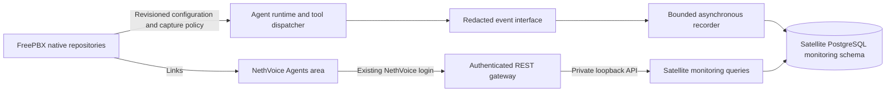

# Phase 3 — NethVoice Agents monitoring

Planning date: 4 October 2026. Status: source implementation present; validation
and deployment pending. See [the implementation report](phase3-development.md)
and [the implemented API contract](monitoring-api-contract.md). No Phase 3 live
configuration changes have been made.

## 1. Confirmed scope

Phase 3 implements roadmap **M1: application shell and monitoring**.

The owner confirmed:

- Deliver monitoring first; API integrations and files follow in later phases.
- Provide a dedicated **Agents** area in NethVoice, using its existing login,
  with links from the FreePBX integration pages.
- Retain execution metadata by default. Conversation transcripts require an
  explicit setting for each agent. Audio recording has its separate lifecycle.

The product remains dedicated to NethVoice. The broader sequence stays
`monitoring → API integrations → files as context → workflow authoring`.
The advanced transfer/consultation track retains its separate roadmap scope
and follows the application priorities in PLAN.md section 101.2.

The owner also confirmed **NethVoice administrators only**, metadata retained
for **30 days**, and enabled transcripts retained for **7 days**. Both retention
periods are configurable. These are release defaults, not unlimited history.

## 2. Phase 2 evidence and changes needed

Baseline: NethVoice code `3dad7715`, Satellite runtime `d8e2b58`, and the
published `agent` images deployed to `nethvoice51`. See
[the CI acceptance report](phase2-ci-test-report.md).

Automated validation includes 118 passing runtime tests, nine PHP suites,
deployed HTTP/policy checks, Playwright, controlled OpenAI conversations,
native call records, and restart recovery. Human listening, exact email/VAT
pronunciation, and the actual external incoming-call path remain pending.
Phase 3 planning does not convert those checks into completed acceptance.

| Implemented boundary | Phase 3 consequence |
|---|---|
| Shared, redacted EventSink with per-run sequences | Add a durable recorder behind the event interface; retain bounded, nonblocking emission |
| EventSink history is a 512-event in-memory deque | This is insufficient for a historical monitoring interface; journald is diagnostic evidence, not the application database |
| call_status exposes active calls only | Add historical run queries and reconcile incomplete traces after restart |
| Provider adapters normalize tools and call lifecycle | Add explicit, optional transcript/usage capabilities there; do not put provider parsing in views |
| FreePBX owns profiles, credentials and configuration hashes | Keep that authority; monitoring reads safe projections and saves capture policy through the native repositories |
| PostgreSQL exists for Satellite transcription | Reuse it with a separate monitoring schema and an independent service-enablement condition |
| Runtime cache volume is excluded from backup and reset on restore | Store history in PostgreSQL, not in that disposable cache |
| Native CDR/CEL identifiers are limited to 32 characters | Preserve the Phase 2 fix; use sufficiently sized application correlation columns |
| Tool success and final call outcome are different observations | Show both; successful tool execution cannot imply a successful conversation or handoff |
| Provider responses can reuse previous tool results | A trace must distinguish observed invocations from inferred answer provenance |

Refactor only the seams required here. The fixed built-in tool allowlists can
be generalized when connectors arrive; Phase 3 does not require a workflow
engine or a generic tool/plugin loading framework.

## 3. Operator experience

### Overview

Show active runs, recent terminal outcomes, tool errors, configuration sync
status, and monitoring health. Live ownership comes from the runtime; historical
rows last marked active must be labeled stale when the runtime is unavailable. Every counter identifies its time range and
whether history is complete. Measured usage may be shown when available;
missing usage is “unavailable”, never zero. Monetary cost calculation is deferred.

### Runs

Provide paginated search/filtering by time, built-in agent, provider, execution
outcome, tool error, and run/session correlation ID. Start with Internal and
External built-in runs. Existing CleverAI destinations remain usable; their
unobserved execution must not appear as a fully monitored successful run.

### Run detail

Show:

- Agent/profile, provider, start/end, duration, applied configuration revision
  and hash, and opaque voice/CDR correlation identifiers.
- Ordered admission, provider setup, conversation, tool and handoff events.
- Tool invocation status/duration and bounded error codes, without raw arguments
  or results in the default metadata view.
- Terminal reason and any fallback, ambiguous handoff, interruption or gap.
- Transcript availability and, when authorized, a separate conversation view.

Do not equate a `call_ended` event with business success. Interrupted or partial
traces need their own visible status. A committed handoff ends Agent ownership;
Phase 3 does not claim whether the subsequent human conversation succeeded.

### Agents and monitoring settings

Show a read-only inventory of the two seeded profiles and their observed runs.
Link to the existing FreePBX profile/trunk configuration pages. Provide global
history-retention settings and per-agent transcript opt-in through a single
native configuration repository. Changes to prompts, routes, permissions and
provider bindings continue through their current editors.

English/Italian text, responsive layouts, keyboard navigation and empty,
loading, unauthorized, unavailable, expired and partial-history states are
part of the delivered interface. Do not add inactive API/file/workflow menus.

## 4. Architecture and ownership

### UI and authentication

Implement the Agents navigation/routes in the existing NethVoice Wizard shell.
Keep its feature views, client data-access code and contracts isolated in an
Agents module so later application features can extend it. Reuse the current
frontend build and login integration; a new frontend framework is unnecessary
for this increment.

The inspected Wizard uses `User`/`Secretkey` headers and the authenticated REST
middleware, which verifies administrative access. Add a namespaced monitoring
gateway there. It validates identity/authorization on every request and forwards
only bounded, allowlisted operations to Satellite. The private Satellite Bearer
token remains server-side. Do not accept browser-supplied backend URLs, arbitrary
headers, or an identity asserted only by the client.

Safe read APIs are instance-scoped. Transcript reads, retention/policy changes,
and transcript deletion have separate authorization checks even if the initial
administrator role receives them all. Mutations use the existing authenticated
request convention and applicable CSRF/origin protection. Clear private view
state on logout; do not cache transcript responses in browser storage.

### Storage and services

Use a dedicated schema in the existing Satellite PostgreSQL instance, with
versioned additive migrations and a repository interface. Vector search is
not needed for monitoring. Use a separate least-privilege database role for the
monitoring reader/writer where practical; its secret uses the module secret-file
pattern and never Redis environment state.

Start PostgreSQL when monitoring is enabled even if call/voicemail transcription
is disabled. Preserve the independent voice runtime: history database failure
must degrade monitoring without preventing calls, changing tool permission
checks, or forcing caller hangup. MQTT remains a transcription dependency.

NS8 owns service enablement and retention-job scheduling. Satellite owns run,
event and transcript history. FreePBX owns profile capture settings and publishes
them through the configuration snapshot. The new UI is a client of those owners,
not a second profile writer or an additional mutable copy.

### Recorder semantics

- Keep synchronous emission small and redacted; enqueue without waiting for DB I/O.
- Bound queue memory and batch sizes; database calls run outside the voice loop.
- Assign stable event IDs and retain per-run sequence numbers. Retry persistence
  with unique constraints so duplicate delivery does not duplicate observations.
- Store timestamps in UTC and present local time in the UI. Receipt time and
  provider/event time are distinct when both exist.
- Expose writer health, backlog, dropped observations and last successful write.
- On queue overflow/DB outage, mark the affected interval or run as incomplete.
  Record a gap marker when storage recovers. A process crash can leave an unknown
  gap count; do not pretend the loss is precisely known.
- Reconcile traces from an earlier runtime epoch with no terminal event to
  `interrupted`/`unknown`, without replaying tools or controlling old calls.
- Flush with a bounded shutdown deadline. Do not advertise zero-loss audit
  recording or resumable execution from this monitoring implementation.

## 5. Data and API contracts

Proposed logical records:

| Record | Content |
|---|---|
| Run | Instance/run/session IDs; agent/provider; execution kind; runtime epoch; configuration identity; timestamps; lifecycle outcome/reason; history completeness |
| Event | Stable event ID; schema version; run and sequence; timestamps; allowed metadata fields |
| Invocation | Invocation/tool IDs; observed start/end; status; duration; error code; completeness |
| Transcript segment | Run/item/response IDs; caller/assistant role; ordering keys; finalized text; interruption/completeness; expiry; capture-policy identity |
| Recorder health | Runtime epoch; writer state; backlog/drop counters; outage intervals; last successful persistence |
| Policy | Global retention and limits; per-agent transcript setting; change revision and actor |

Application IDs/correlation columns support the actual opaque IDs without
truncating them to native CDR widths. Store revision/hash identity, not full
configuration snapshots containing prompts or credentials. Caller phone numbers
and raw provider payloads are excluded from default metadata. Add personal
caller details only through a separately agreed need and access policy.

Emit bounded observations for rejected/invalid tool requests as well as
executed tools; the existing pre-dispatch rejection path needs this addition.
Admission rejected before a run exists is a service-level observation, not a
fabricated active call. Preserve the current runtime ownership behavior.

The private monitoring API is a separate router from configuration/call control.
The browser gateway exposes a matching bounded surface. Proposed operations:

- Read overview/monitoring health.
- List runs with cursor pagination and validated filters.
- Read one run, its paginated events and invocation summaries.
- Read finalized transcript segments when authorized and enabled.
- Read safe agent inventory and current monitoring policy.
- Update capture/retention policy through native repositories.
- Delete a run's stored transcript, with an actor/time metadata audit record.

Freeze exact paths, request/response schemas and error codes in the first
implementation milestone. Limit requests to 100 records per page. Use parameterized
queries and deterministic `(time, id)` cursors. Scope checks apply to detail IDs
and transcript IDs as well as list queries. Transcript responses use `no-store`.
General inbound run creation, replay, resume, cancellation and call-control
buttons are later capabilities; history reads cannot trigger execution.

Keep the run/event model applicable to later API-triggered work: voice references
are optional and execution kind is explicit. Parent/step correlation can be
added compatibly when workflow execution actually exists.

## 6. Optional transcripts

Existing and upgraded profiles default to transcript capture **off**. Enabling
capture requires an explicit per-agent setting and a supported provider
capability. Keep text separate from the metadata EventSink and journald.

For the deployed OpenAI adapter, implement and validate caller and assistant
transcript handling on the existing **Realtime SIP sideband**. Keep provider
protocol details within the adapter. The current adapter does not normalize
transcripts or collect measured usage.

Official Realtime documentation describes audio responses with transcripts and
output transcript events; input transcription requires its own configuration.
Use the Realtime contract rather than silently adopting Live endpoints.
Sources reviewed 4 October 2026:
[Realtime call acceptance](https://developers.openai.com/api/reference/cli/resources/realtime/subresources/calls/methods/accept),
[Realtime conversation events](https://developers.openai.com/api/docs/guides/realtime-conversations),
[transcription events](https://developers.openai.com/api/docs/guides/realtime-transcription).
Validate exact session options and supported transcription model during the
provider capability spike before pinning implementation settings.

Transcript requirements:

- Do not start a second recording/upload pipeline or enable legacy call
  transcription/MQTT just to populate monitoring.
- Persist finalized caller/assistant segments with deduplication and stable
  item/response ordering. Async arrival order is not conversation order.
- Label caller text as speech recognition. Assistant text is generated output;
  interruption/truncation may mean it was not all heard by the caller.
- Mark disabled, unsupported, failed, partial, truncated, expired and deleted
  states explicitly. Absence of text is not evidence of silence or success.
- Bound transient text buffers and total stored text per run. Escape text in
  the UI; it cannot execute markup, change policy or grant tools.
- Encrypt stored transcript content with an application-owned key retained in
  the protected module secrets backup. Do not include text in normal logs,
  monitoring error messages, metadata exports or configuration snapshots. If the
  key is missing or content persistence fails, expose capture as unavailable;
  never fall back to plaintext storage or disrupt the voice call.
- Show that enabling caller transcription may add provider processing/usage.
  Keep usage unknown when it cannot be measured reliably.
- Calculate expiry from the terminal timestamp (or reconciled end for interrupted
  runs), using UTC. Keep transcript retention at or below metadata retention;
  deleting an expired run also removes its transcript and invocation/event rows.
- Start enabled capture on new calls. Disabling capture stops further local
  persistence for active calls as well; attempt provider transcription shutdown
  only where supported without disrupting the voice session.
- Delete/expire text in the database, caches and queued writes. A deletion marker
  prevents a delayed transcript event from recreating deleted content. Recheck
  current capture/deletion policy when committing queued text, not just at enqueue. Do not
  imply that local deletion removes provider-held data or existing backup copies.

OpenAI is the first live acceptance target because its binding is configured.
Grok metadata remains supported; transcript availability must be feature-detected
and separately validated before advertising it. Unsupported providers can run
normally with metadata-only monitoring. A Grok transcript live check requires
an approved binding and credentials.

## 7. Delivery milestones

| Milestone | Deliverable | Completion evidence |
|---|---|---|
| P3.0 — Contracts and capability checks | Freeze record/API schemas, outcome mapping, limits, auth integration and transcript capability; complete Phase 2 acceptance review | Architecture decisions recorded; representative event fixtures; confirmed policy defaults; provider configuration contract verified |
| P3.1 — Durable history | Recorder/repositories, PostgreSQL migration, completeness/gap reporting, run reconciliation and retention | Historical runs survive restart; duplicate events remain single records; DB failure/overflow stay bounded and visible |
| P3.2 — NethVoice monitoring | Authenticated gateway, Agents overview/list/detail/inventory, FreePBX links | Logged-in authorized user traces a call and its tools; unauthorized requests fail; Playwright desktop/mobile and empty/error states pass |
| P3.3 — Transcript opt-in | Native capture policy and sync, provider normalization, protected storage, conversation view and deletion | Opt-out stores no text; opt-in caller/assistant text appears with ordering/provenance; disabling/deletion prevents late writes; unsupported capability is explicit |
| P3.4 — Operations and acceptance | Backup/restore, additive upgrade, rollback procedure, resource/failure validation, CI images and deployment report | Published images match source/digests; restore preserves permitted history/policy; prior routes, handoff and transcription still work; human listening findings recorded |

P3.0 precedes persistence and UI integration. P3.2 follows a working reader/store;
transcript implementation follows the proven metadata path. Every milestone
includes its required authorization, bounds and failure behavior.

Source boundaries:

- `nethesis/satellite`: event recorder, storage/query contracts, run projections,
  private monitoring API and provider transcript/usage normalization.
- `ns8-nethvoice`: Wizard Agents feature and REST gateway; native policy repository
  and migration; service lifecycle, backup/restore, UI/image build and runtime pin.

Use the existing coordinated CI to build the runtime and consume its immutable
image digest in the module before deploying through supported NS8 actions.
For this source implementation, `runtime-ref` identifies the upstream base;
`runtime-patches/phase3.patch` and `runtime-overlay` package the extensions in
this repository. The build archives that base and applies those versioned
extensions without mutating the checkout. Once integrated upstream, update
`runtime-ref` and remove the matching patch/overlay together. No node-local image
is release evidence.

## 8. Acceptance and deployment gates

Write tests as part of implementation; none are run by this planning task.

| Area | Required scenarios |
|---|---|
| Events/history | Successful call, setup/provider failure, denied/invalid tool request, tool timeout, fallback, committed and ambiguous handoff, missing/repeated/out-of-order events |
| Isolation/auth | Anonymous request, invalid identity, role change, cross-instance identifier, transcript access denial, rejected arbitrary gateway operation, logout clears private UI state |
| Content | Default-off upgrade; opt-in two speakers; overlapping/late events; interrupted output; text caps; markup injection; disable during active call; deletion races; no text in metadata/logs |
| Retention | Independent metadata/text expiry, batch purge, quota pressure, expired transcript display, later writes blocked after deletion |
| Failure | DB down/slow, full writer queue, writer crash, process restart, unclean shutdown, missing encryption key, service recovery |
| Compatibility | Stable destinations/trunks; profile policy ceiling; handoff ownership; transcription disabled/enabled; voicemail/TTS; supported older snapshot defaults |
| Lifecycle | Fresh install, repeated migration, Phase 2 upgrade, DB dump/restore with transcripts/policy/key, clone policy, additive downgrade/rollback |
| UI | Overview/list/detail, filters/cursors, stale/partial history, transcript states, responsive 1440/768/390 px, keyboard use, no page errors |
| Load | Proposed initial target: 10 simultaneous controlled/mock calls, 100,000 historical runs, bounded memory, indexed queries, no voice-loop DB blocking |

Record CPU/RAM and DB size for the target node before setting final quotas.
Proposed first targets are a 4 MiB recorder queue, 8 KiB metadata events,
256 KiB transcript text per run, 5-second active-view refresh, and a 100-row
page limit. Apply independent count/byte bounds. Large text must have an explicit
truncation marker. Tune these through measured P3.0/P3.4 results, not silent
unbounded defaults. Metadata retention remains enforced after transcript expiry.

Backup must include the monitoring PostgreSQL schema, policy and content key.
Reuse the existing PostgreSQL dump/restore integration and test the new service
condition when transcription is disabled. Do not add the disposable Agent
replay/cache volume to backup. After restore, run expiry before serving old text;
preserve terminal histories and mark previously open runs interrupted, keeping
Phase 2 configuration sync. Clone starts with fresh execution history; restoring
a backup preserves its eligible history within the restored instance.
Retained backup copies follow the backup administrator's policy.

Deploy acceptance to the approved `nethvoice51` instance only after CI succeeds,
with a protected rollback snapshot, independently verified zero active calls,
source/digest checks and bounded controlled tests. Clean up owned test clients,
audio and debug logging. Keep production release status distinct from test
instance deployment and record any remaining human checks.

## 9. Follow-on milestones

| Later milestone | First outcome | Guidance needed when detailed planning begins |
|---|---|---|
| M2 — API integrations | One authorized business HTTP integration plus an authenticated non-voice run entrypoint through shared execution | Actual target API, operations/read vs write, credential ownership and confirmations |
| M3 — File context | Upload/version approved documents, inspect ingestion, grant access and return grounded results with provenance | Representative files, formats/size, local vs provider processing, retrieval and deletion policy |
| M4 — Workflow authoring | Publish explicit agent/tool/context/branch steps and inspect pinned-version runs | Initial workflow, editing experience, reusable agents and human wait/approval needs |
| V — Advanced voice | Supervised/consultative transfer, recipient decision and caller resumption | Exact slot after application priorities; extension-first acceptance targets |

Phase 3 supplies reusable monitoring contracts for these milestones. Their
execution engines, connector operations and resource lifecycles receive their
own detailed plans when their implementation becomes the next task.

## 10. Decision record

| Choice | State |
|---|---|
| Phase 3 scope: monitoring first | Confirmed by owner |
| Dedicated NethVoice Agents area; existing login | Confirmed by owner |
| Metadata default; transcripts opt-in per agent | Confirmed by owner |
| Initial operators: NethVoice administrators only | Confirmed by owner |
| Retention defaults: metadata 30 days / transcripts 7 days | Confirmed by owner; configurable |
| Existing PostgreSQL, isolated monitoring schema | Technical proposal based on existing service/backup support |
| Existing Wizard shell and authenticated REST gateway | Technical proposal based on inspected login implementation |
| Exact operational limits | Proposed targets; validate and freeze during P3.0 |
