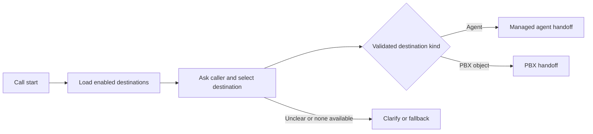
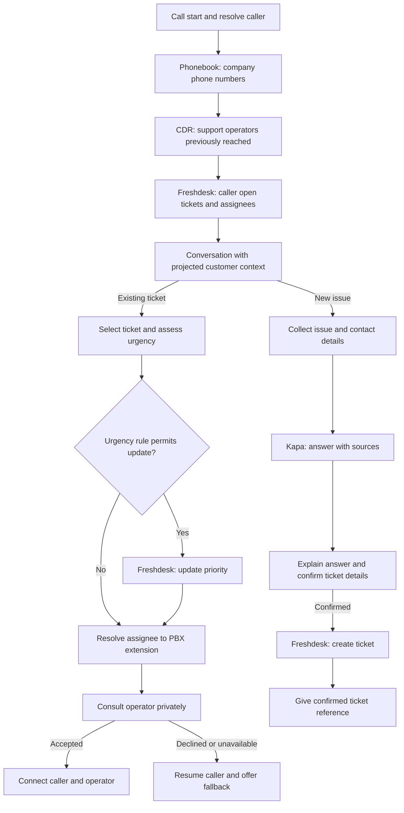
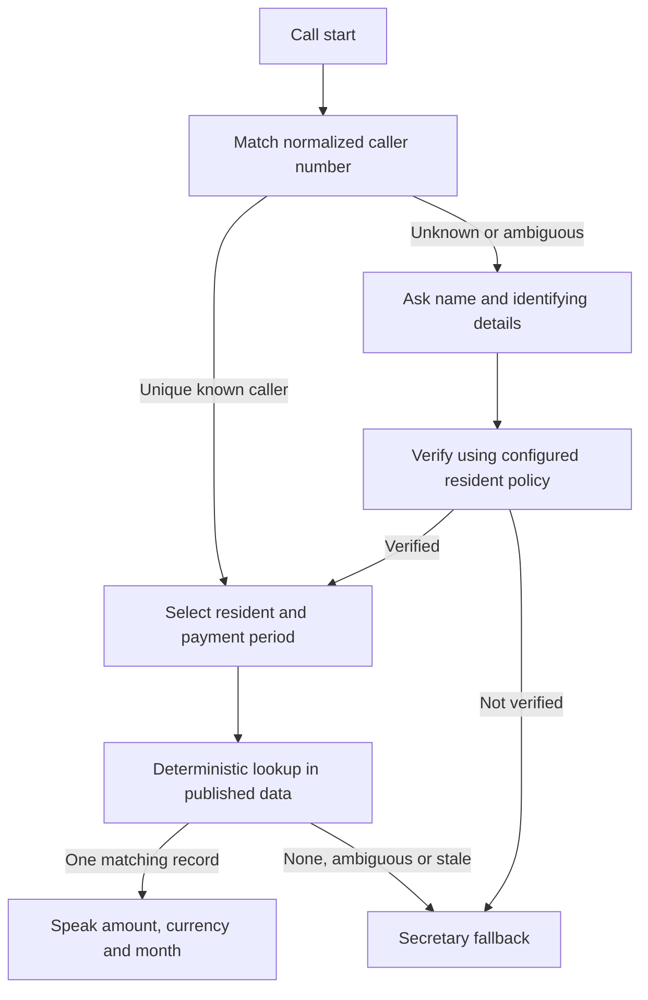

# Phase 5 — Visual agent builder

Planning date: 5 October 2026. **Source and test deployment delivered; live acceptance is partial.**
See the [implementation report](phase5-development.md), [test report](phase5-test-report.md)
and [frozen API contract](workflow-api-contract.md).
The outcome is an administrator-facing diagram editor, a reusable block library,
and executable custom agents supporting the three workflows below. Deliver working
workflows in stages, as confirmed by the owner; simulated integrations alone do
not complete this phase.

This increment brings together roadmap M4 authoring, the M3 data resources needed
by the payment secretary, and the V consultative-transfer capability needed by
customer support. It refines the previous delivery sequence for these examples.
It does not mark outstanding Phase 2–4 acceptance complete. See
[Phase 4 implementation](phase4-development.md) and [roadmap](../PLAN.md#101-draft-roadmap-for-the-broader-agent-application).

## 1. Decisions and product boundary

| Decision | State |
|---|---|
| NethVoice PBX administrator builds agents through connected blocks, in an n8n-style interface | Owner requirement |
| New agents appear alongside built-in agents, with their available tools | Owner requirement |
| Deliver all three working voice workflows in stages | Owner confirmed |
| Consult privately, require operator acceptance, resume the caller on rejection/no answer | Owner confirmed |
| Payment disclosure: a unique caller-number match is sufficient; verify unknown callers | Owner confirmed |
| Freshdesk and Kapa are the customer-support integrations | Owner requirement; sandbox configuration still needed |
| Keep existing Wizard shell, Satellite runtime, PostgreSQL and shared tool dispatcher | Technical proposal based on current source |
| Use Drawflow behind a small editor adapter | Implemented with locally bundled 0.0.60; local browser/compiler checks passed |
| New router targets default disabled; administrator can set per-type defaults and per-object overrides | Proposed default; supports enabling/disabling all targets |
| Ticket creation and priority escalation both require caller confirmation | Owner confirmed during implementation |
| Unknown payment callers verify an exact resident code and a unique name; bounded similar-name matching is optional | Owner approved bounded matching on the test secretary; controlled known/unknown payment calls passed |
| Private Sheets uses a read-only service account; the test setup uses a published Google CSV | Owner replaced the test authentication setup with the public CSV |

“Agent” is the published callable behavior, including its graph, prompt settings,
tools, resources, provider binding and entrypoint policy. “Block” is a typed unit
on that graph. “Template” is a copyable starting graph. “Reusable block” is a
published subflow with declared inputs/outputs. These are separate concepts in
the API; administrators mainly see Agents, Blocks, Connections and Data sources.

Phase 5 includes text, CSV, XLSX and a read-only Google Sheets source for the
payment example. It does not require a general document RAG system. Arbitrary
code/shell nodes, model-generated SQL, n8n workflow import, background schedules,
unbounded loops and long-lived human approval jobs are outside this increment.

## 2. Inspected baseline and changes required

Baseline: module working tree and Satellite commit
`77592a76e9e17dac063aacb1731e57d26fc6eac2`, recorded in [runtime-ref](runtime-ref).

| Existing boundary | Phase 5 change |
|---|---|
| AngularJS 1.8 Wizard, existing Agents controllers/service, administrator gateway | Add catalog, editor, block library and data-source views within the same shell |
| Agent inventory/settings assume built-in profile names and FreePBX configuration links | Unified inventory with display names, kind, status, editor link, entrypoints and effective tools |
| Runtime configuration validates exactly `internal`/`external`; voice admission accepts built-in destination types | Add a versioned custom-agent binding contract and admission resolver; retain v1 built-in behavior |
| Phase 4 API runner is the fixed `support-request` preset | Generalize definition resolution while preserving its existing API contract |
| Tool registry supports built-ins plus granted connector operations | Add block manifests and narrowly scoped PBX/data operations using the same dispatcher |
| External voice connectors are restricted to public read-only data | Add explicit caller/customer scope, private lookup and voice-effect authorization |
| `telephony.handoff` releases the caller to PBX routing | Add managed agent handoff and a separate consultative-transfer state machine |
| Phonebook has company and several phone fields; CDR has multiple legs per call | Purpose-built, parameterized read queries with normalization and leg-aware matching |
| Application PostgreSQL owns connector versions, credentials and effect ledger | Add custom definitions, subflows, data resources and workflow control records |

Relevant source boundaries are `freepbx/wizard-ui/app/scripts/{controllers,services}`,
`freepbx/var/www/html/freepbx/rest/modules/agents.php`, the FreePBX Satellite
repositories/dialplan, and upstream Satellite `agent/{configuration,runtime,tools,application,monitoring}`.
Runtime changes are delivered as the repository-owned `phase5-runtime.patch`
against `runtime-ref`, with a checksum and source assembly/build guard. Upstream
publication is pending; no required runtime change is left only in an ignored
development checkout. See the implementation report for retiring this temporary
patch after upstream acceptance.

## 3. Administrator experience

### Agent catalog

Creating an agent immediately adds a **Draft** row alongside Internal, External
and other existing agents. Each row shows name, description, kind, enabled state,
published version, voice/API availability and tools. Drafts are visible but not
callable. Built-ins retain their existing configuration owner and links.

The details view distinguishes tools used by deterministic steps from tools the
LLM may choose during a conversation. Show the effective tool list for each
entrypoint, versions, read/write classification, resource scope, and reasons a
configured tool is unavailable. Listing a tool never grants it automatically.

Actions: create from template/blank, edit, duplicate, validate, test, publish,
enable/disable, inspect runs and select an earlier published version. Publication
validates references; voice activation additionally waits for PBX synchronization.
Show Draft / Published / Pending PBX sync / Ready / Disabled / Invalid states.

### Editor

```text
Agents > Customer support        Draft 4     Save  Validate  Test  Publish
+--------------------+------------------------------+---------------------+
| Blocks             |                              | Selected block      |
| Search             | Call -> Caller -> History    | Name / description  |
| Conversation       |             \-> Tickets     | Connection          |
| PBX                |                 -> Decision  | Inputs from ...     |
| Data               |                 /        \   | Output fields       |
| Tools / APIs       |           Existing      New  | Error / timeout     |
| Logic              |                              | Tool/resource scope |
| My reusable blocks |                              |                     |
+--------------------+------------------------------+---------------------+
| Validation: 1 missing connection | Test trace: selected step -> result  |
+-----------------------------------------------------------------------+
```

Provide drag/add/connect, named ports, zoom/fit, undo/redo, duplicate/delete,
keyboard node selection and connection creation. A form-based step/connection
list gives the same editing operations without dragging, including on narrow
screens. Use English/Italian labels and existing Wizard styling. Escape user
text; never compile imported strings as Angular templates or executable HTML.

The right inspector uses schema-generated fields and an input picker such as
“Caller → phone” or “Ticket lookup → assigned operator”. Show sample data and
types, required values and unavailable branch outputs. Advanced expressions are
a restricted typed mapping language, not JavaScript or PHP. Secret selectors
reference existing connections; no credential values enter graph JSON.

Select a group of compatible blocks → “Save as reusable block”, define its
inputs/outputs, validate, publish and add it to the library. Existing workflows
pin its version; updates require an explicit upgrade. Recursive subflows are
rejected. Templates can be duplicated and customized without editing seed data.

Test mode accepts a synthetic caller, sample variables and fixtures. It displays
the path, step timings and bounded projected results. Mock tests are visibly
labelled. Real reads, sandbox writes and controlled test calls have separate
explicit test actions. Editing or opening a graph never invokes a tool.

### Canvas library decision

Start the P5.0 spike with **Drawflow**: its upstream project documents vanilla
JavaScript without dependencies, multiple input/output connections, node events,
zoom and import/export under MIT. That makes it a plausible fit for the existing
AngularJS/Grunt shell without introducing another application framework.
[Source](https://github.com/jerosoler/Drawflow).

The spike must prove build compatibility, teardown/re-entry without leaks,
safe labels, connection validation, 100-node responsiveness, keyboard/list
editing, undo/redo and lossless conversion to our own definition format. These
are application requirements, not assumed library features. Pin and bundle a
reviewed release locally; do not load a floating CDN asset in the PBX UI.

Rete.js is the fallback if Drawflow's editing constraints prove costly. It has
modular renderers but no supplied vanilla-JS renderer; using it here needs a
renderer integration. Review each plugin's license because some advanced plugins
are noncommercial. This is a tradeoff, not a decision to migrate Wizard.
[Rete FAQ](https://retejs.org/docs/faq/),
[licensing](https://retejs.org/docs/licensing/).

Neither library's engine/export format becomes the server execution contract.
Do not embed n8n itself or reuse Visualplan's routing graph as the agent graph.
Visualplan continues to select stable callable Agent destinations.

## 4. Definition, block library and execution model

### Canonical contract

Store a versioned JSON definition with these logical fields:

| Field | Purpose |
|---|---|
| `schema_version`, `agent_id`, revision and display metadata | Stable identity; separate draft concurrency token and immutable publication version |
| `entrypoints`, `input_schema`, `output_schema` | Voice/API capability and typed inputs/results |
| `nodes[]` | Stable node ID, block type/version, configuration and input bindings |
| `edges[]` | Source node/outcome port and target node; explicit control flow |
| `resources`, `tool_grants`, `provider_binding_ref` | Versioned references and authority; never raw credentials |
| `limits`, `fallback` | Run/step/turn budgets, error handling and PBX fallback |
| `layout` | Positions/groups/viewport, excluded from execution semantics |

Block manifests declare input/output schemas, editable configuration schema,
named outcomes, required capabilities, permitted entrypoints, timeouts and effect
classification. Server validation is authoritative. The same manifest catalog
drives the palette, form editor, tests and tool availability preview.

### Initial library

| Category | Blocks | Result / intent |
|---|---|---|
| Start/end | Call start, API start, Return/end | Trusted input context and explicit terminal outcome |
| Conversation | Speak, Collect fields, Agent decision | Speak approved data; collect typed fields; bounded LLM conversation producing validated outcomes |
| Logic | Condition/switch, Map fields, Merge alternatives | Deterministic routing and data projection; no arbitrary evaluation |
| Identity | Resolve caller, Verify unknown caller | Candidate identity, evidence and policy-scoped verified binding |
| PBX | Destination catalog, Opening hours, Route to PBX, Route to agent | Catalog filtered by enablement/visibility; trusted destination IDs |
| PBX data | Company contacts, Support call history | Bounded phonebook/CDR lookups with typed parameters |
| APIs | Invoke connector operation | Phase 4 operation selected from approved connections |
| Data | Table lookup, Text extraction/lookup, Name match | Deterministic record selection with source/version/row provenance |
| Effects | Confirm action | Bind caller confirmation to exact operation, fields, run and expiry |
| Voice | Consultative transfer | Accepted / declined / busy / no-answer / unavailable / failed / unknown |
| Reuse | Subflow | Invoke a pinned reusable block with a reduced scope |

Freshdesk and Kapa appear as readable presets over registered connector operations,
not separate unrestricted HTTP executors. Administrators can create new business
blocks from a connector operation or a subflow. New executable block types remain
developer-owned implementations with tests and manifests.

### Execution semantics

Use explicit control flow with typed data bindings. Run one selected branch at a
time initially; parallel forks are unnecessary for these examples. A merge of
alternative paths executes once from the taken path. Inputs must be available on
every path reaching a node, or explicitly optional. Reject dangling ports,
unknown versions, incompatible types, unreachable executable nodes and cycles.

Conversation blocks can make multiple bounded conversational turns and invoke
only their assigned tools. They return a typed outcome to the graph, rather than
rewriting it. Clarification/retry happens inside bounded blocks; an exhausted
block takes its failure/timeout edge. Every fallible step has an explicit handler
or inherits the workflow fallback. No response is not the same as an empty result.

The Python runtime compiles/validates the graph and executes it through existing
dispatch services. Add provider-neutral operations for updating allowed context,
speaking/collecting and completing a conversation step. Verify those operations
on the actual voice adapter before promising seamless step transitions; the
current provider contract is not yet a workflow conversation API.

Use one owned caller session with at most one active speaking controller.
Agent-to-agent routing is a managed, terminal handoff to a pinned child agent,
carrying only mapped context, caller policy and the remaining budget. It does not
create an uncontrolled parallel speaker. Subflows return data; agent handoffs
transfer conversation ownership. Preserve parent/child run links and bound
handoff depth. The caller's original external/internal provenance cannot be
upgraded by entering another agent.

Proposed initial limits, to measure in P5.0: 100 nodes/200 edges, subflow depth 4,
agent handoffs 4, 200 step executions, 5 clarification turns per collect/decision
block, 64 KiB projected context and 10-second default data-operation deadline.
Voice max duration inherits an explicit agent cap. Slow operations announce a
short wait and follow a timeout path; ingestion never runs during a call.

On admission pin graph, subflow, connector, resource and binding versions. Draft
edits affect no current run. Live disable/revoke checks prevent subsequent use.
After a crash, mark unfinished execution interrupted/unknown; do not advertise
automatic voice resumption or replay effects. Durable control state and the
effect ledger are separate from best-effort monitoring.

## 5. Use case 0 — Call router



Provide a seeded editable Call router template. Its catalog includes published
custom agents, built-in agents and supported PBX destinations. Initial PBX kinds
are extensions, queues and IVRs, matching current runtime capabilities; other
PBX objects need an explicit adapter and must not appear routable prematurely.

The catalog panel supports enable all/disable all, per-kind defaults, individual
overrides, display names, descriptions and synonyms. Defaults also govern newly
discovered objects; individual overrides win. Proposed initial defaults are off.
Preview exactly what an external caller's router will see. Availability/enablement
is separate from the existing visibility and transfer permission ceilings.

The runtime offers only eligible targets and rechecks before committing routing.
Deleted, disabled, unpublished or unsynchronized agents cannot be selected.
Exclude self-routing and detect routing cycles/depth exhaustion. No target or an
unclear request takes clarification and then a configured human destination.
The model chooses an ID from the allowed catalog, never a dial string.

## 6. Use case 1 — Customer support



Implement `Company contacts` as a fixed parameterized query over the phonebook
database, normalizing home/work/mobile numbers and country prefix rules.
Multiple companies/shared numbers require disambiguation. Company strings may
be inconsistent; provide administrator mapping or a stable business key. Company
membership helps routing but does not automatically authorize reading coworkers'
tickets. The caller's open tickets remain scoped to their allowed identity.

`Support call history` receives those numbers, a configured support extension/
queue set and bounded lookback (proposed 90 days). Query `asteriskcdrdb`, account
for answered bridge legs/transfers and deduplicate by call identity. Do not assume
`dst` is always the human who answered. Return operator IDs, recency and count;
missing/ambiguous history is advisory, never evidence that a person is available.
Use read-only credentials, query/row/time limits and server-side parameter binding.
PBX-local queries stay in the PBX integration boundary; do not expose database
credentials or arbitrary SQL to the model.

Freshdesk operations: resolve contact; list scoped open tickets; read selected
ticket and assignee; update priority; create ticket; reconcile uncertain effects
where supported. Define “open” from the actual account status fields. Maintain
an explicit Freshdesk assignee ID → PBX extension map. Missing/unassigned/deleted
operators route to a configured support queue; never infer extension from a name.
The official API documents ticket creation/update and assigned responder fields.
[Freshdesk API](https://developers.freshdesk.com/api/).

Phase 4 only implements static bearer/API-key headers. Include Freshdesk's
documented API-key Basic-auth mode as a reviewed credential type; verify sandbox
authentication, custom ticket fields, rate limits and exact response projections
before publishing presets. Do not assume the generic connector already fits.

Kapa must return a bounded answer plus sources or an explicit no-answer outcome.
Select the supported HTTP answer/query contract for the supplied project; if the
account exposes retrieval only, add an answer step grounded in returned passages.
Verify streaming/JSON compatibility with Phase 4's transport before selection.
[Kapa HTTP integration example](https://docs.kapa.ai/examples/embed-an-ai-assistant-in-your-app-that-answers-questions-and-takes-actions).
Missing Kapa evidence routes to ticket collection without inventing an answer.
Ticket creation is still offered after providing an answer, as requested.

### Voice writes

An LLM can propose urgency and extract issue fields; the dispatcher checks the
published rule, caller scope, allowed priority change and exact ticket ID.
Urgency policy permits escalation only and requires explicit caller confirmation.
Ticket creation reads back the issue/contact details and requires an explicit
caller confirmation tied to their digest; edits invalidate the confirmation.
Capture confirmation as bounded control evidence, independent of whether general
transcript storage is enabled. Ambiguous speech requires clarification.

Reuse the durable effect ledger and stable business-operation identity across
model calls and graph steps. Verify remote duplicate/reconciliation behavior;
do not assume Freshdesk has an idempotency guarantee. An uncertain create must
not be retried automatically or announced as successful. A confirmed ticket may
remain created even if the caller disconnects immediately afterwards.

### Consultative transfer

The voice controller owns hold, outbound leg, private consultation and bridging;
the graph only requests transfer and handles a typed outcome. Sequence:

1. Validate the mapped extension and create one transfer attempt under a lock.
2. Place caller on hold; dial operator with a bounded ring timeout.
3. On answer, privately deliver the approved summary and ask for acceptance.
4. Initially use deterministic DTMF accept/decline (proposed 1/2); speech acceptance
   can follow provider validation. Answer alone never commits the handoff.
5. On acceptance, atomically bridge caller/operator and release agent ownership.
6. On decline, busy, no answer or consultation timeout, clean up the owned leg
   and resume the caller's conversation. Offer another approved destination.

The caller must not hear private consultation; the recipient receives only
approved issue context. Recipient speech cannot invoke caller tools. Handle
caller/operator hangup in every state, late acceptance, duplicate events and
uncertain bridge commit. Never hang up a successfully handed-off caller or retry
an ambiguous transfer. Start with extensions; queue consultation is not implied.

## 7. Use case 2 — Payment secretary



Honor the owner-selected policy: a unique caller-number binding is sufficient for
that resident's information. Shared numbers or ambiguous matches take the unknown
caller path. Asking for a name helps locate candidates; an unknown caller must
also pass the configured verification rule before private amounts reach the LLM.
The owner selected a resident code as the initial rule; an unconfigured code
falls back to the secretary. No OTP service is silently assumed.

Create a data-source wizard with upload/connect, preview, field mapping, validation
and publish. Canonical record fields: resident/customer ID, name, phone numbers,
building/unit, payment period, decimal amount and currency. Explain missing,
duplicate and invalid rows before publication. Use decimal arithmetic and a
configured locale; never ask the LLM to calculate or guess the amount.

| Source | Preparation outside the live call |
|---|---|
| CSV | Preview delimiter/encoding/header; map columns and validate periods/amounts |
| XLSX | Select sheet/header and columns; read cell values without executing macros/formulas; flag missing/stale calculated values |
| Text | Preserve lines/sections; configured extraction pattern to canonical records with preview; unparseable records cannot publish |
| Google Sheets | Read a selected spreadsheet ID/range into the same validated, versioned table; show last refresh and errors |

Use exact normalized identity matching first, then normalized name/token or
bounded regex matching to generate candidates. Pattern matching is a deterministic
tool, never model-generated executable code. Ambiguous/fuzzy results need
disambiguation; no first-result selection. Bound regex execution and input length.
Return only the authorized resident's requested row(s) to the conversation, with
source version and row/line reference. Do not place the full building sheet in
the prompt. Scope period queries explicitly, including the administrator's
timezone/current-month rule.

Google Sheets requires read authorization beyond Phase 4 static credentials.
Propose a read-only service account shared onto the selected spreadsheet for the
first implementation; individual Google-account OAuth is a follow-on unless
required by the deployment. Token handling stays server-side and encrypted.
The Sheets API exposes spreadsheet/range operations; authentication and refresh
must be implemented as a resource adapter.
[Google Sheets API](https://developers.google.com/workspace/sheets/api/guides/concepts).

Store original files and normalized rows with immutable versions and provenance.
Ingestion runs in a bounded worker, separate from the voice event loop; cap file
size, decompressed workbook size, sheets/rows/cells and parse time. A practical
starting envelope is 10 MiB uploads and 50,000 rows, subject to measured sizing.
Support manual refresh and configurable periodic snapshot refresh for Sheets;
this is resource refresh, not a general workflow scheduler. A failed refresh
cannot silently replace valid data. Configure a maximum acceptable age and make
stale data take an explicit fallback. Pin versions at call admission and recheck
revocation before retrieval; new calls use the newly published snapshot.

## 8. Ownership, publication, API and operations

FreePBX remains authoritative for PBX destinations, trunks and the two native
profiles. Satellite's application repository owns new custom agent definitions,
subflows, resources and execution control. Unified inventory is a projection,
not a competing profile writer. Existing built-ins remain usable during an
application-store outage; custom admission with unavailable state falls back.

Custom voice agents require a new stable FreePBX destination type referencing an
application agent ID and approved provider/trunk binding. Do not overload CleverAI
flow fields. Publish the definition, provision/update the destination idempotently,
and mark Ready only after configuration acknowledgement. Track desired/applied
versions and reconcile partial failures across PostgreSQL and MariaDB; there is
no assumed distributed transaction. Preserve destination IDs when publishing or
rolling back. Referenced agents/resources cannot be hard-deleted.

Extend the authenticated Wizard gateway with fixed routes for definition drafts,
validation, publication, history, block catalog/subflows, inventory/tool preview,
resource ingestion/status and controlled test runs. Use expected revisions on
edits and actionable conflict responses. Add additive custom-definition IDs to
machine-run admission; voice-only graphs are rejected by API runs or require an
explicit non-voice branch. Freeze exact JSON schemas/routes/errors in P5.0.

Workflow authorization is the intersection of agent grants, caller/client scope,
node grants, resource restrictions and current revocations. Child agents/subflows
cannot gain authority from their own broader configuration. Data bindings retain
identity provenance; model text cannot manufacture a verified identity. Reuse
Phase 4 HTTPS destination policy and encrypted credential storage for connectors.

For router handoffs, distinguish tools exposed to the router from its published
delegation allowance for each target agent. The support agent may use support
tools under that allowance without exposing those tools to the router's LLM.
Intersect the target grants with the delegated scope and original caller ceiling;
enabling a destination alone does not authorize private data access or writes.

Monitoring adds graph version/hash, parent/child IDs, step ID/attempt, selected
outcome, timing and safe error codes. The graph overlay reads the pinned graph,
not today's draft. Sensitive tool outputs and payment/ticket data stay out of
ordinary metadata; controlled test inspectors and optional retained content use
explicit access, bounded retention and encryption. Metadata gaps remain visible.

Back up definitions, grants, files/normalized resources, ledgers and required
keys. Uploaded originals and normalized records are encrypted inside PostgreSQL,
so the existing complete dump preserves both. No separate upload volume is used. Test restore references and resource expiry before
serving calls. Preserve the current fresh-clone behavior that excludes application
state; cloned definitions/resources require an explicit later policy change.
Restore must not replay prior writes or revive interrupted voice calls.

## 9. Delivery stages and acceptance

| Stage | Deliverable | Evidence required before completion |
|---|---|---|
| P5.0 — Contracts and editor spike | Definition/block contracts, Drawflow integration, conversation adapter spike, representative integration/data fixtures | Round-trip all three sample graphs; keyboard/list authoring; documented provider and library feasibility; freeze limits and API schemas |
| P5.1 — Vertical slice: router | Agent catalog, draft/publish, core executor, tool list, PBX/custom destinations and Call router template | Administrator builds/publishes router, reaches built-in/custom agent and PBX targets, disables targets, inspects trace; fallback and active-version pinning verified |
| P5.2 — Payment secretary | Resource lifecycle, CSV/text/XLSX/Sheets adapters, deterministic lookup, identity blocks and reusable subflows | Real calls for unique known caller and verified unknown caller; ambiguity/staleness/no-match fallback; exact spoken amount/currency/month and row isolation |
| P5.3 — Support data and voice effects | Phonebook/CDR blocks, Freshdesk/Kapa presets, context assembly, confirmation/urgency rules | Actual sandbox lookup, priority change and confirmed ticket creation; no-answer Kapa path; duplicate/uncertain-effect tests and tool restrictions |
| P5.4 — Consultative support routing | Private consultation, acceptance/decline, caller resumption and completed support template | Controlled calls covering accept/decline/busy/no-answer/disconnect/races; listening confirms hold/private audio isolation and correct summary |
| P5.5 — Integrated delivery | Packaging, docs, authoring usability, migrations, restore and load evidence | PBX administrator builds all three from the library, publishes, receives actual calls and diagnoses outcomes without editing JSON/code |

Each stage ships functioning software with its own failure handling and tests.
P5.1 uses basic handoff; it does not claim the completed support transfer feature.
P5.3 can validate ticket behavior before P5.4 adds operator consultation. Final
Phase 5 completion requires all examples, including every listed payment source.

Cross-cutting checks:

- Definition validation: illegal cycles, missing outputs on a branch, revoked
  references, incompatible capabilities, malicious imports and version conflicts.
- Runtime: deadlines, cancellation/disconnect, restart interruption, unavailable
  database/keys, one speaker, no duplicate effect or unsafe transfer replay.
- UI: EN/IT, keyboard and list alternatives, desktop/narrow layouts, unsaved
  changes, validation errors, secret omission and no browser console errors.
- Business: shared caller numbers, phone normalization, missing company, multiple
  tickets, stale/missing assignee map, multi-leg CDR, rate limiting and API failure.
- Data: repeated resident names, accented names, locale/decimal/month ambiguity,
  formula/macro inputs, large/corrupt files, failed Sheets refresh and deletion.
- Lifecycle: additive upgrade, existing built-in/CleverAI routes, provider binding
  compatibility, live disable/revoke, referenced-version retention, backup/restore.

Use mocks for repeatable unit/integration tests; real service and voice acceptance
need an approved sandbox and controlled calls. Reuse coordinated Satellite/module
CI and immutable image evidence. No production deployment is authorized by this
planning document, and existing Phase 2–4 open release gates remain recorded.

## 10. Guidance still needed, at the relevant stage

These inputs do not block editor/contracts work; do not invent their values:

1. **Before P5.1 activation:** desired router defaults and first exposed PBX
   objects/agents; which provider/trunk to use for custom agents.
2. **Before P5.2 business acceptance:** representative anonymized file/sheet;
   shared-number/resident mapping; refresh and
   staleness limits. Resident-code verification and read-only service-account
   Sheets access are confirmed.
3. **Before P5.3 business acceptance:** Freshdesk sandbox and custom fields,
   caller/customer authorization, support-team definition, assignee/extension map,
   urgency escalation rule, Kapa project/HTTP contract and credentials configured
   through the secret UI. Do not paste secrets into planning documents.
4. **Before P5.4 live tests:** target extensions, ring/consultation timeouts,
   fallback destination. DTMF 1/2 implements explicit operator acceptance.

Source for P5.0–P5.5 is present. The live service/call and installed-administrator
acceptance gates above remain open; local fixtures do not close them.

The owner selected `nethvoice51` at `voice.makako.sf.nethserver.net`, OpenAI
binding `1`, caller extension `201`, read-only Freshdesk tests and dummy Kapa.
The test images are deployed; the router/payment agents are enabled and the full
support graph is a draft because writable Freshdesk operations were omitted from
the test connector. A seeded payment sheet and encrypted CSV snapshot are ready.
The owner later provided a published Google CSV, which is configured without
credentials, and operator `202`. Live consultation acceptance, sustained native
bridging and decline/resumption passed. Router-to-secretary handoff and payment
lookup for known/verified unknown callers also passed controlled SIP tests. Private service-account Sheets remains an
optional adapter. See [Sheets setup](google-sheets-setup.md) and the test report for
the exact acceptance boundary.
